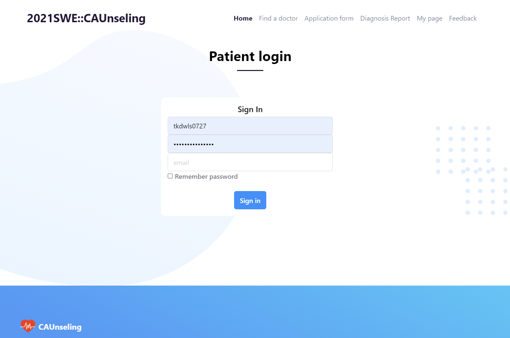
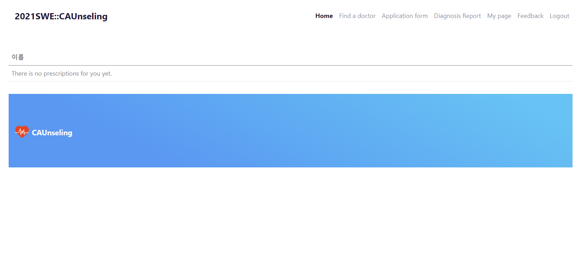
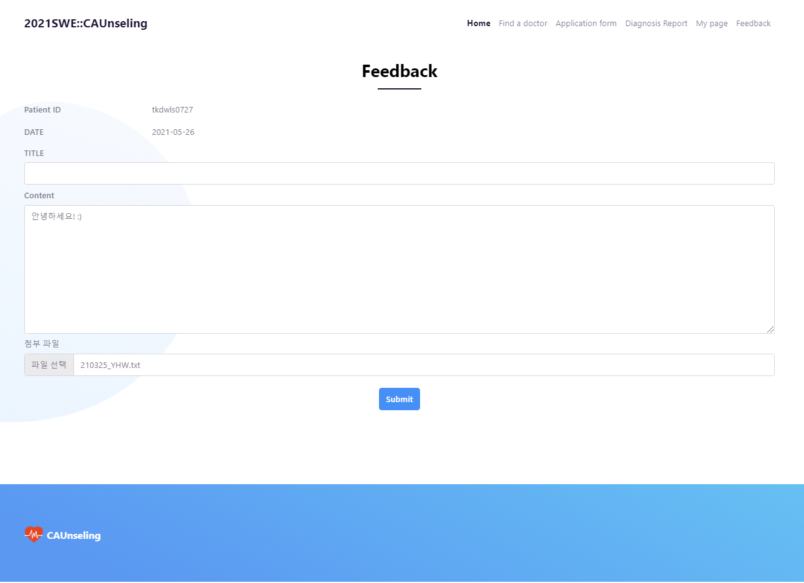

# Patient 페이지 소개  

  
## 00. patient/main 화면 : patient의 메인페이지.  
  
  
  
## 01. patient/login에서 사용자가 시스템을 이용하기 위해 로그인을 진행하게 된다.  
  
  
  
## 02. patient/signup 화면 : 환자용 회원가입 페이지이다.  
  
  
  
## 03. patient/details 화면 : 환자가 본인의 정보를 확인/수정할 수 있는 페이지.  
  
  
  
## 04. patient/prescription 화면 : 환자가 본인의 처방전을 조회할 수 있는 페이지.  
  
  

## 05. patient/search : 환자가 본인을 진료할 수 있는 의사를 검색할 수 있는 페이지.  
  
  

## 06. patient/application_form : 환자라 진료를 예약하기 위해 의사 명/자신의 증상을 기입하는 페이지.  
  

## 07. patient/feedback : patient의 feedback 페이지. 자신의 진료 기록에 대한 피드백을 남길 수 있는 페이지.  
  